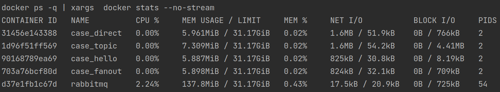
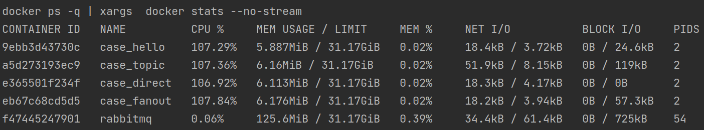
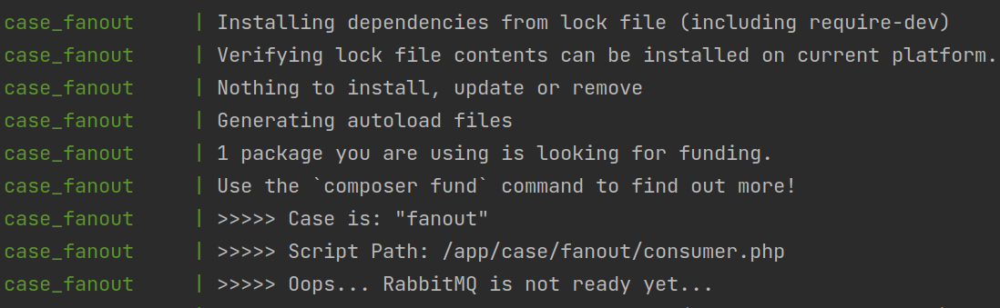
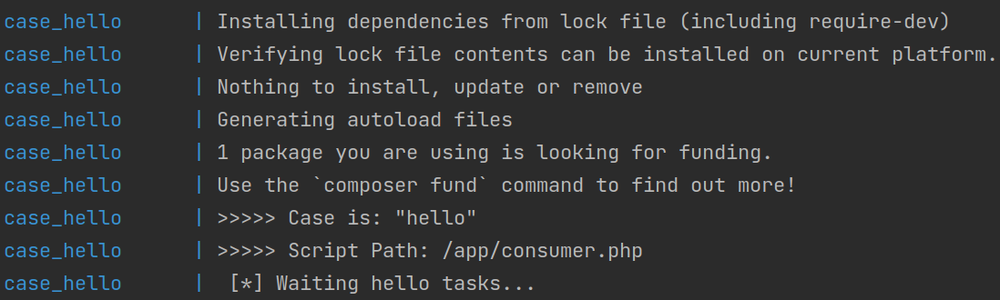

# RabbitMQ with PHP inside Docker

This repository will help reproduce examples of working with RabbitMQ queues for the PHP language using Docker containers.

The result of receiving and processing the task from the broker will be a txt file like `case_fanout_2023-08-26_11-57-00.txt`.

For all consumer services, one pre-generated image will be used: **rabbitmq-php-orchestra**. Its size is 117 megabytes.

The makefile contains the most useful commands.

> Stress testing involves printing **100 million points** per cycle **for each consumer for each case**.

#### The algorithm is very simple:
- git clone... 
- `make upb`
- wait a little
- `make publish` or `make publish_direct`
- check txt-file for the actual case
- profit

Enjoy!

### Make commands
List of commands
<details>
  <summary>details...</summary>

* publish: `docker-compose exec case_hello php publish.php`
* publish_all: `make publish ; make publish_direct ; make publish_fanout ; make publish_topic`
* publish_direct: `docker-compose exec case_direct php case/direct/publish.php`
* publish_fanout: `docker-compose exec case_fanout php case/fanout/publish.php`
* publish_topic: `docker-compose exec case_topic php case/topic/publish.php`
* down: `docker-compose down`
* sdown: `docker-compose down & rm -f *.txt`
* fdown: `docker-compose down & rm -f *.txt & rm -rf vendor`
* upd: `docker-compose up -d`
* upb: `docker-compose up -d --build --remove-orphans`
* stats: `docker ps -q | xargs  docker stats --no-stream`
</details>

##### Complete start of the orchestra
```shell
make upb
```

##### Complete stop of the orchestra
```shell
make fdown
```

##### Publish "hello" task
```shell
make publish
```

##### Publish some exchange task
```shell
make publish_fanout
```

Available examples of exchanges:
- fanout
- direct
- topic

##### Get stats
```shell
make stats
```

### Environment
List of environment variables
<details>
  <summary>details...</summary>

* RMQ_IMAGE: image name created by the builder
* RMQ_STRESS_TEST: enable/disable stress testing
* RMQ_CASE: some exchange case (if empty - hello case)
* RMQ_IS_BUILDER: is service builder or not
* RMQ_HOST: rabbitmq hostname
* RMQ_PORT: rabbitmq port
* RMQ_PORT_ADMIN: rabbitmq admin panel port
* RMQ_LOGIN: rabbitmq user login (php code)
* RMQ_PASSWORD: rabbitmq user password (php code)
* RMQ_CONSUMER: consumer for actual case
* RABBITMQ_DEFAULT_USER: user login
* RABBITMQ_DEFAULT_PASS: user password
</details>

### Screenshots
##### Statistics at rest

##### Full load statistics

##### Rabbit is not ready yet

##### Rabbit is ready now


